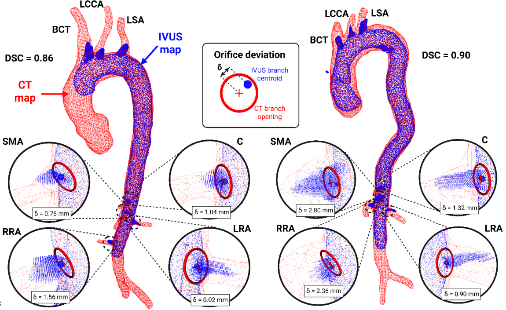

# CT–IVUS Non-Rigid Registration

This repository contains the Python implementation of a semantically driven non-rigid registration pipeline for aligning three-dimensional intravascular ultrasound (IVUS) reconstructions with preoperative computed tomography (CT) vascular models. The method uses vascular branch anatomy to establish correspondences between CT and IVUS skeletons, followed by constrained non-rigid iterative closest point registration to account for deformation between preoperative and intraoperative anatomy.

The code corresponds to the CT–IVUS registration component described in:

> **Learned ultrasound segmentation and deformable CT fusion for augmented reality endovascular surgery**  
> Tom M. Dillon, Diego Quevedo Moreno, Emma K. Rutherford, Brian Ayers, Brett Salomon, Boateng Kubi, Jonah Thomas, and Ellen Roche  
> *medRxiv*, 2026  
> [Paper](https://doi.org/10.64898/2026.07.15.26358084)

<p align="center">
  
</p>

<p align="center"><em>Overview of the semantic correspondence estimation and non-rigid CT–IVUS registration pipeline.</em></p>

## Method overview

The registration pipeline:

1. Loads the CT vascular model, CT centerline, reconstructed IVUS surface, and IVUS centerline.
2. Identifies vascular branch locations and constructs labeled skeleton graphs.
3. Estimates correspondences between IVUS and CT branches.
4. Initializes alignment from the matched vascular anatomy.
5. Applies non-rigid iterative closest point registration while constraining branch-orifice correspondence.
6. Visualizes and exports the registered CT and IVUS geometries.


## System requirements

The software was tested in the following system requirements:

- Ubuntu/Linux
- Python 3.9
- A graphical desktop session capable of displaying Open3D and OpenCV windows
- A C++ compiler and CMake for building the Voxblox Python bindings
- At least ~500 MB of open disk space for the selected Zenodo dataset and generated outputs

A CUDA-compatible GPU is optional for TensorFlow inference. TensorFlow uses an available compatible GPU when one is visible to the installed TensorFlow build; otherwise it runs supported operations on the CPU. CPU execution is expected to be slower.


## Quick start

Create and activate a Python 3.9 virtual environment:

```bash
python3.9 -m venv .venv
source .venv/bin/activate
python -m pip install --upgrade pip
```

Install the pinned Python packages:

```bash
python -m pip install -r requirements.txt
```

Clone the repository and enter its directory:

```bash
git clone https://github.com/tdillonmit/CT_IVUS_non_rigid_registration.git
cd CT_IVUS_non_rigid_registration
```

Run the included example dataset:

```bash
python semantic_non_rigid_registration.py patient_1
```

The dataset name should correspond to a folder under `datasets/`. The estimated installation time approximately 10–20 minutes on Ubuntu, assuming Python 3.9. This may take longer if an Open3D installation is required.


## Data

The complete dataset associated with the paper contains IVUS images, electromagnetic tracking transformations, ECG recordings, preoperative CT-derived models, and centerline data from in vitro and in vivo experiments. 

[](https://doi.org/10.5281/zenodo.20737792)

Full dataset: [Zenodo record 20737792](https://doi.org/10.5281/zenodo.20737792)

The code for reconstructing the IVUS-EM data (which would precede the steps highlighted in this repository) can be found at: https://github.com/tdillonmit/IVUS_EM_reconstruction

## Citation

Please cite the associated paper when using this code:

```bibtex
@article{dillon2026learned,
  title   = {Learned ultrasound segmentation and deformable CT fusion for augmented reality endovascular surgery},
  author  = {Dillon, Tom M. and Quevedo Moreno, Diego and Rutherford, Emma K. and Ayers, Brian and Salomon, Brett and Kubi, Boateng and Thomas, Jonah and Roche, Ellen},
  journal = {medRxiv},
  year    = {2026},
  doi     = {10.64898/2026.07.15.26358084}
}
```

## Acknowledgments

The Viterbi skeleton-matching implementation was adapted from the University of Bonn's [4D Plant Registration](https://github.com/PRBonn/4d_plant_registration) repository.

## Contact

For questions regarding the code or dataset, please contact Tom Dillon through the repository's GitHub issue tracker.
